# SLAppMdlOpt
This is the reproducible repository for the paper "Fine-Grained Performance and Cost Modeling and Optimization for FaaS Applications."
This repository includes all algorithms, modules, scripts, and experimental results presented in the paper.

## Overview of the methodology
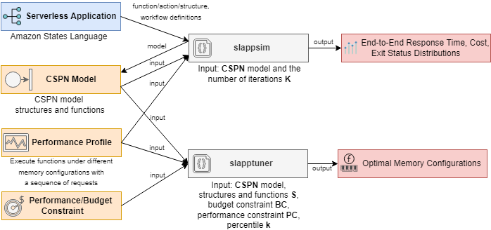
* Conditional stochastic Petri nets to effectively model concurrency, parallelism, synchronization, randomness, and billing in serverless applications or any software systems with similar patterns.
* Modeling rules to convert states, actions, and structures in the serverless application into CSPNs.
* Two ready-to-use Python modules to help define serverless applications with CSPNs and solve the performance/cost trade-off.
* A performance and cost modeling algorithm that enables the fine-grained estimation of the distribution of the response time, cost, and exit status of serverless applications.
* A depth-first bottleneck alleviation algorithm that achieves fine-grained performance and cost tuning for serverless applications by solving two optimization problems with accurate performance/cost constraints (e.g., tail latency and high-percentile cost).
* Models and algorithms verified by experiments on AWS.

## Artifacts
* [slappsim](./slappsim): a Python package to (1) implement CSPNs, (2) convert states, actions, and structures in the serverless application into CSPNs, (3) implement the performance and cost modeling algorithm based on CSPNs sampling, and (4) perform the fine-grained estimation of the distribution of the response time, cost, and exit status for given serverless application and configuration.
* [slapptuner](./slapptuner): a Python package to (1) implement the depth-first bottleneck alleviation algorithm and (2) perform fine-grained performance and cost tuning for serverless applications by solving two optimization problems with accurate performance/cost constraints.
* Scripts for Evaluation and Experimental Results (Section 6)
  * [Performance and Cost Modeling](./modeling) (Section 6.1)
    * [Sequence](./modeling/Sequence): a serverless application that contains a sequence.
    * [Parallel](./modeling/Parallel): a serverless application that contains a parallel.
    * [Choice](./modeling/Choice): a serverless application that contains a choice.
    * [Map](./modeling/Map): a serverless application that contains a map.
    * [Choice](./modeling/textprocessing): a serverless application for text processing.
    * [structures](./modeling/structures): scripts for profiling the four functions used to construct the above four applications.
    * [sfn-delay](./modeling/sfn-delay): scripts for analyzing the initialization latency/scheduling overhead incurred by the orchestration service.
    * [AppMdl](./modeling/AppMdl): the serverless application with sixteen functions and four types of structures for evaluating the modeling algorithm (presented in Fig. 8(b)).
    * [Results](./modeling/results): experiment results (Section 6.1.2)
  * [Performance and Cost Optimization](./optimization) (Section 6.2)
    * [profile-functions](./optimization/profile-functions): scripts for obtaining the performance profile of the six functions and the performance profile (presented in Fig. 10).
    * [App](./optimization/App): a serverless application with six functions and four types of structures for evaluating the optimization algorithm (presented in Fig. 8(a)).
    * [DFBA-PRCP](./optimization/DFBA-PRCP): comparison between the DFBA algorithm and the PRCP algorithm.

## Requirements
* Python >= 3.9.0

Required Python packages are listed in [requirements.txt](requirements.txt)

Installation:
```
pip install -r requirements.txt
```

## Usage
### CSPNs and the performance and cost modeling
Please refer to any of the Jupyter notebooks used for evaluating the performance and cost modeling algorithm ([AppMdl.ipynb](./modeling/AppMdl/AppMdl.ipynb), [Sequence.ipynb](./modeling/Sequence/Sequence.ipynb), [Parallel.ipynb](./modeling/Parallel/Parallel.ipynb), [Choice.ipynb](./modeling/Choice/Choice.ipynb), [Map.ipynb](./modeling/Map/Map.ipynb)), which are commented and self-explanatory. Please refer to the code snippets in the "End-to-end RT and Cost Derived from the Modeling Algorithm" section of the notebook.

### Performance and cost optimization (DFBA algorithm)
Please refer to any of the Jupyter notebooks used for evaluating the performance and cost optimization algorithm ([App.ipynb](./optimization/App/App.ipynb), [DFBA-PRCP.ipynb](optimization/DFBA-PRCP/DFBA-PRCP.ipynb)), which are commented and self-explanatory.

## Appendix
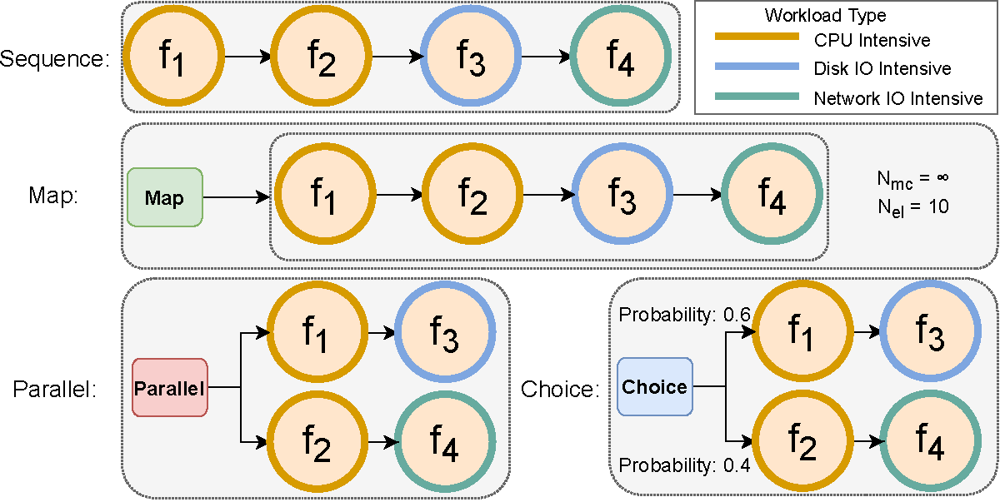

The above figure illustrates the workflow of the four serverless applications used for evaluating the modeling algorithm (Section 6.1), which contain one structure. The file `definition.json` in each corresponding directory contains the application definition in Amazon States Language.

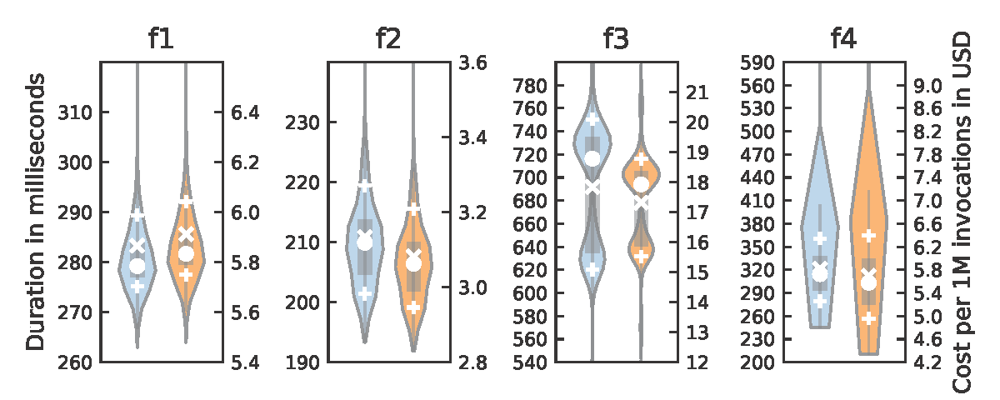

The above figure presents the performance profile of the four functions used to construct the four applications mentioned above. The original data can be found in [`Structures_lambda_logs.csv`](./modeling/structures/Structures_lambda_logs.csv). For each function, the left violin plot (with the left y-axis) illustrates the distribution of the function execution duration in milliseconds, and the cost per 1 million executions in US dollars is shown on the right (with the right y-axis). The markers +, x, and o represent the 90th/10th-percentiles, the average, and the median, respectively.

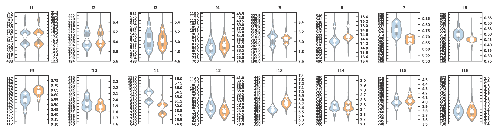

The above figure presents the performance profile of the sixteen functions used to construct the serverless application with sixteen functions (Section 6.1). The original data can be found in [`AppMdl_lambda_logs.csv`](./modeling/AppMdl/AppMdl_lambda_logs.csv). The legend is the same as the figure above.

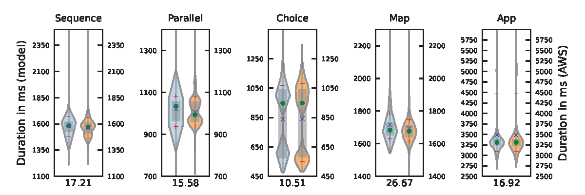

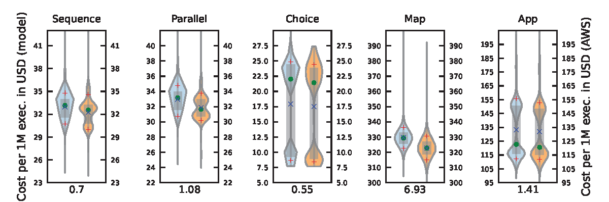

The comparison between the distribution of the application response time and cost derived by the proposed algorithm and that reported by AWS. The markers +, x, and o represent the 90th/10th-percentiles, mean, and median, respectively.

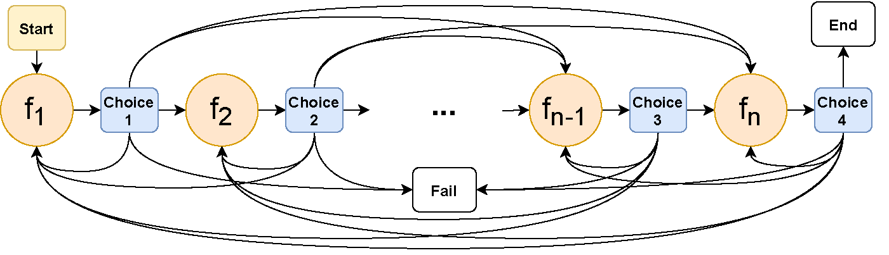

The serverless application workflow in the worst-case scenario, which is composed of n serverless functions that form a strongly connected component (SCC)


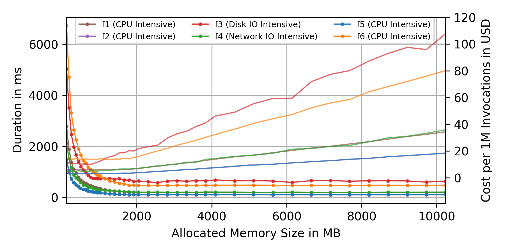

The performance profile of the six functions used to construct the serverless application for evaluating the optimization algorithm (Section 6.2). The file [`OptAlg_lambda_logs.csv`](./optimization/profile-functions/OptAlg_lambda_logs.csv) contains the original data.

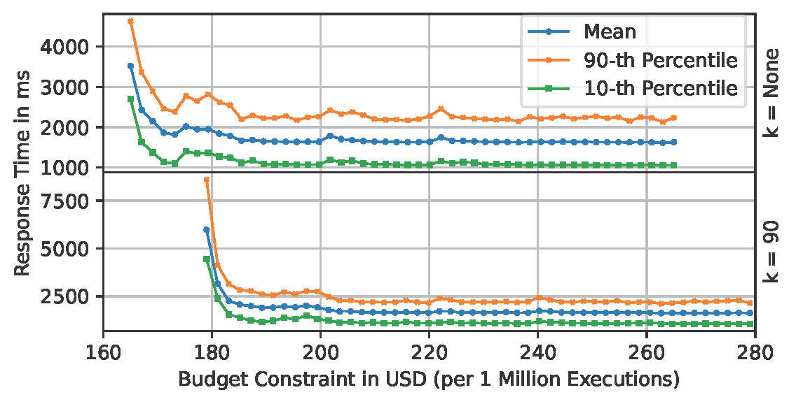

The evaluation results of the DFBA algorithm when solving the BPBC problem. The original data can be found in the JSON files in [this directory](./optimization/App/BPBC/).

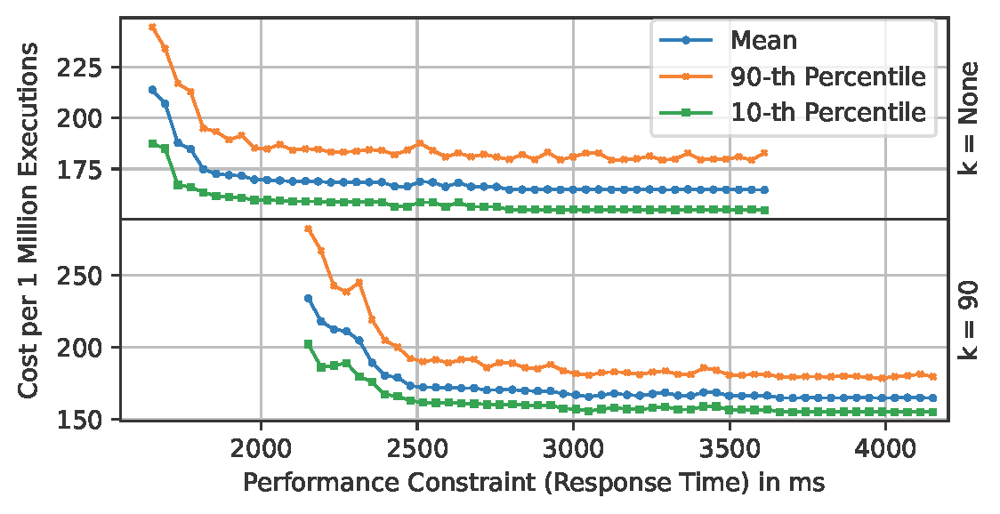

The evaluation results of the DFBA algorithm when solving the BCPC problem. The original data can be found in the JSON files in [this directory](./optimization/App/BCPC/).

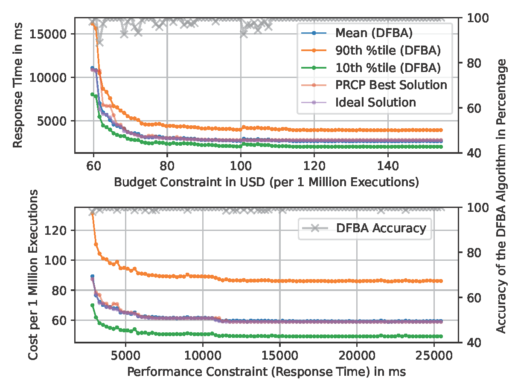

Comparison between the DFBA algorithm (k = None) and the PRCP algorithm solving the BPBC/BCPC problems. The original data can be found in [this directory](./optimization/DFBA-PRCP/).

## Abstract
Function-as-a-Service (FaaS) has become a mainstream cloud computing paradigm for developers to build cloud-native applications in recent years. By taking advantage of serverless architecture, FaaS applications bring many desirable benefits, including built-in scalability, high availability, and improved cost-effectiveness. However, predictability and trade-off of performance and cost are still key pitfalls for FaaS applications due to poor infrastructure transparency and lack of performance and cost models that fit the new paradigm. In this study, we therefore fill this gap by proposing formal performance and cost modeling and optimization algorithms, which enable accurate prediction and fine-grained control over the performance and cost of FaaS applications. The proposed model and algorithms provide better predictability and trade-off of performance and cost for FaaS applications, which help developers to make informed decisions on cost reduction, performance improvement, and configuration optimization. We validate the proposed model and algorithms via extensive experiments on AWS. We show that the modeling algorithms can accurately estimate critical metrics, including response time, cost, exit status, and their distributions, regardless of the complexity and scale of the application workflow. Also, the depth-first bottleneck alleviation algorithm for trade-off analysis can effectively solve two optimization problems with fine-grained constraints.


## Citation
Please refer to [https://doi.org/10.1109/TPDS.2022.3214783](https://doi.org/10.1109/TPDS.2022.3214783)

## License
This artifact repository is licensed under the MIT license. Please refer to the [LICENSE](LICENSE) file for details.
